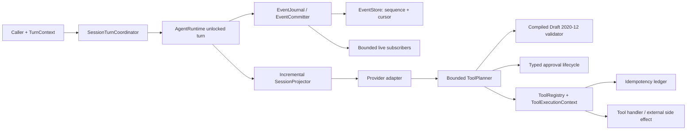

# Kaji Python and TypeScript Production-Beta Implementation Plan

> **For agentic workers:** REQUIRED SUB-SKILL: Use `subagent-driven-development` to implement this plan task-by-task. Keep the Python and TypeScript contract changes in the same checkpoint whenever they alter a shared event, manifest, tool, or release contract.

**Goal:** Make the stable Kaji Python and TypeScript SDK core safe and supportable as a production beta by closing same-session races, enforcing complete tool and integration contracts, bounding execution and memory, proving cross-SDK parity, and making the published artifacts reproducibly verifiable.

**Architecture:** Preserve the current `AgentBuilder -> AgentRuntime -> provider -> ToolPlanner -> ToolRegistry` shape, but insert four explicit shared boundaries: a per-session turn coordinator, a store-backed event journal with monotonic ordering, a compiled JSON Schema tool validator, and a bounded tool executor carrying an end-to-end execution context. Define those semantics once in machine-readable contracts and fixtures under `kaji/contracts/`; implement them independently in Python and TypeScript; then gate release on parity, deterministic complexity checks, installed-artifact smoke tests, and keyed stable-provider proof.

**Tech Stack:** Python 3.11+, asyncio, Pydantic 2, `jsonschema` Draft 2020-12, pytest, Ruff, ty, uv; TypeScript 6, Node 22/24, Zod 4, Ajv 2020, Vitest, tsup, Bun; JSON Schema 2020-12; ast-grep; GitHub Actions; GitButler for implementation checkpoints.

**Status:** Approved for implementation. The Subagent-Driven Development preflight amendments below were selected before Task 1. This document supersedes the narrow, gate-only plan in `docs/superpowers/plans/2026-07-07-kaji-sdk-ts-beta-hardening.md`.

### Approved preflight amendments

These decisions govern wherever later task prose is ambiguous:

1. **Event drafts and stored events are different types.** `NewKajiEvent` never has a sequence; `StoredKajiEvent` always has one. Stores return `AppendResult { event, inserted }` so duplicate writes cannot be re-published.
2. **The journal owns cursor subscription and delivery.** Its subscribe handshake joins backlog and live events without a gap. The stable in-memory implementation commits and enqueues atomically. Experimental split adapters retain a pending-delivery outbox and retry publication without asking the runtime to repeat a turn.
3. **Callers do not write the store directly.** Runtime/journal append APIs are canonical; writable store exports remain only as deprecated compatibility paths outside the beta guarantee.
4. **Projection is cached and cursor-based.** A warm runtime reads only the suffix after its last sequence. Cold replay is bounded by explicit in-memory capacities. `history()` is paginated. Snapshots are deferred until durable stores or histories beyond the beta cap are promoted.
5. **Non-cooperative timed-out tools retain their permit until they settle.** They remain tracked as unknown-outcome work; shutdown exposes a bounded drain deadline and diagnostics. Kaji never pretends an ignored abort stopped the side effect.
6. **Tool argument processing is validation-only in both SDKs.** Defaults, coercions, and transformations do not mutate handler input. TypeScript may run Zod refinements but passes the original validated object, matching Python JSON Schema behavior.
7. **Parity is three-way.** Python and TypeScript outputs must each match checked-in golden fixtures and each other.
8. **Network catalog integrations remain experimental without a bound transport.** A beta-safe network tool requires an application-supplied transport that pins the validated address or an enforced egress proxy. Native `fetch()` after a separate DNS check is not described or tested as rebinding-safe.
9. **Contracts ship inside both artifacts.** Canonical files remain under `kaji/contracts/`; generated package copies are sync-checked and verified in wheel/tarball tests.
10. **Durable events and telemetry have different data rules.** Tool arguments may be persisted for replay subject to payload caps and application storage controls; logs, metrics, traces, and public exception text redact them.

---

## 1. Beta Contract and Scope

The beta promise covers the same stable surface in both packages:

- Agent builder, runtime turn loop, cancellation, sessions, in-memory event store/journal, event replay, tool registry/planner/policy, OpenAI and Anthropic adapters, and the echo integration.
- Same public semantics for session isolation, event order, tool validation, tool failure, cancellation, approvals, and packaged examples.
- Provider-specific wire payloads may differ, but normalized Kaji events and errors must match shared fixtures.

The beta promise does **not** automatically include:

- Python-only Redis event/history backends, voice/TTS, RAG/retrieval, native Gemini/Kimi, or retriever selection. They remain experimental until separately promoted.
- TypeScript HTTP, Web, filesystem, or SQLite catalog integrations until each satisfies the catalog hardening task below. They must be marked experimental and require an explicit CLI opt-in in the meantime.
- Distributed same-session serialization. The beta default is correct inside one runtime process. A coordinator is injectable so a later distributed lease implementation can be supplied without changing `turn()`.
- Exactly-once external side effects. Kaji provides stable call IDs, idempotency keys, and a pluggable result ledger; durable tools still must forward the key to the external system or use durable storage.
- Unbounded or cross-process replay. The beta in-memory store is capacity-limited and the runtime keeps a cursor-based projection cache. Durable snapshotting is a later storage-backend concern.

### Explicit beta defaults

Create `kaji/contracts/beta-core-v1.json` with the following values and make both SDK test suites consume it:

```json
{
  "$schema": "https://json-schema.org/draft/2020-12/schema",
  "$id": "https://kaji.dev/contracts/beta-core-v1.json",
  "contractVersion": "1.0.0",
  "runtime": {
    "sameSessionTurns": "serialized",
    "crossSessionTurns": "concurrent",
    "maxToolIterations": 5,
    "contextWindowTurns": 32,
    "contextWindowCharacters": 100000
  },
  "tools": {
    "schemaDraft": "2020-12",
    "validateFormats": true,
    "maxConcurrency": 4,
    "timeoutMs": 30000,
    "approvalTimeoutMs": 300000,
    "riskRequired": true,
    "idempotencyKey": "session_id:tool_call_id",
    "idempotencyMaxEntries": 10000,
    "idempotencyCompletedTtlSeconds": 86400
  },
  "events": {
    "ordering": "store_sequence",
    "draftSchema": "new-kaji-event-v1.schema.json",
    "storedSchema": "stored-kaji-event-v1.schema.json",
    "warmProjection": "cursor_suffix",
    "subscriberQueueCapacity": 1024,
    "inMemoryStoreMaxSessions": 1000,
    "inMemoryStoreMaxEventsPerSession": 10000,
    "overflow": "typed_error"
  },
  "integrations": {
    "stable": ["echo"],
    "experimentalRequiresOptIn": true
  }
}
```

These are compatibility defaults, not hidden constants. Builders may accept explicit overrides, and diagnostics must expose the effective limits. A later default change requires a new contract version and a changelog entry.

### Release naming

- Python: `0.2.0b1`
- TypeScript: `0.2.0-beta.1`
- Contract: `1.0.0`

Do not publish those versions until Task 16 and every blocking criterion in section 6 pass.

---

## 2. Current Evidence and Why the Existing Shape Is Unsafe

| Concern | Python evidence | TypeScript evidence | Beta consequence |
|---|---|---|---|
| Same-session turns race | `kaji/sdk/src/runtime/agents/runtime.py:155-199` snapshots by list length with no lock | `kaji/ts/src/runtime/runtime.ts:169-191` does the same | Concurrent callers can return each other's text/events and interleave provider/tool work |
| Event order is wall-clock based | `infra/events/schemas.py:10-22`, `store/base.py`, `store/inmem.py`, `replay.py:35-40` | `events/schemas.ts:15-22`, `events/store.ts`, `sessions/replay.ts:79-83` | Equal or skewed timestamps cannot define durable causality |
| Full replay per tool iteration | `runtime.py:243` calls `load_state()` in the loop | `runtime.ts:241-243` rereads/replays the session | Work grows with iterations times history; context is unbounded |
| Shallow tool validation | `runtime/agents/planner.py:50-77` | `tools/planner.ts:35-63` | Nested constraints, enums, formats, bounds, arrays, and extra fields are not enforced |
| Identity/context loss | `agents/builder.py:118-119`, `tools/registry.py:32-43` | `runtime/builder.ts:86-90`, `tools/registry.ts:30-38`, `integrations/functional.ts:89-90` | Tools cannot reliably authorize, correlate, cancel, enforce deadlines, or deduplicate |
| Unbounded tool fan-out | `planner.py:113-148` uses `asyncio.gather` | `planner.ts:159-175` maps into `Promise.allSettled` | One model response can saturate connections, memory, or downstream quotas |
| Partial event delivery | Python centralizes `_emit`, but append and publish are separate at `runtime.py:150-153` | Four direct append/publish pairs in `runtime.ts:177-178,209-210,229-230,289-290` | Persisted-but-unpublished and duplicated-retry states are ambiguous |
| Bus retains duplicate history | `infra/events/bus.py:21-45` | `events/bus.ts:14-106` | Store and bus both hold unbounded history; slow subscribers can grow memory indefinitely |
| Integration schema is descriptive | both `registry/schema.json:28-50`; both `index.json` point at the manifest schema | `scripts/validate_registry.ts`, `scripts/check_integration_sources.ts`, and CLI each validate differently | Invalid auth/index contracts can be accepted by one path and rejected by another |
| Catalog network defaults fail open | n/a in stable Python core | `registry/http/index.ts:12-19` and seven direct `fetch()` calls in HTTP/Web | Missing allowlists, redirects, timeouts, cancellation, and response caps permit unsafe or unbounded I/O |
| Release proof is broken | `.github/workflows/python.test.yml:61-62` calls a nonexistent wheel script | `.github/workflows/ts.test.yml:73-81` calls a nonexistent smoke script; `scripts/verify_api.mts:16-23` falls back to source | Green source tests do not prove clean-install artifacts |

Validated ast-grep probes found:

- Python full-history reads in `runtime.py:179,184,224` and `state.py:7`.
- TypeScript full-history reads in `runtime.ts:171,184,241`.
- Exactly one hard-coded builder tool identity in each SDK.
- No keyed runtime lock map, no bounded tool-pool pattern, no Python `asyncio.timeout`, and no TypeScript `AbortSignal.timeout` in the core tool path.
- Seven catalog `fetch()` calls without a signal.
- Python idempotency helpers are referenced only from tests; TypeScript has no equivalent runtime ledger.
- Ajv appears only in a registry script, not in the TypeScript tool-execution path.

---

## 3. Target System Design



### Turn state machine

```text
queued -> acquired -> bootstrapped -> user_event_committed -> model_running
  -> tools_validating -> approval_waiting? -> tools_running -> model_running
  -> completed

Any state may transition to cancelled or failed.
Every requested tool call must end in exactly one terminal event:
completed | failed | rejected | cancelled.
```

### Event-delivery rule

1. The store assigns a session-local monotonically increasing `sequence` atomically.
2. The journal publishes the persisted event, not the caller's pre-persist object.
3. Append failure reports `persisted=false` and does not publish.
4. Publish failure reports `persisted=true` and exposes the same event ID for a publish-only retry.
5. The store deduplicates identical event IDs and rejects the same ID with a different payload.
6. Replay sorts by `sequence`; timestamps remain observability metadata only.

### Failure vocabulary

Use the same stable codes in both SDKs:

```text
INVALID_TOOL_SCHEMA
INVALID_TOOL_ARGUMENTS
UNCLASSIFIED_TOOL_RISK
MISSING_TOOL_IDENTITY
TOOL_NOT_ALLOWED
APPROVAL_UNAVAILABLE
APPROVAL_REJECTED
APPROVAL_TIMEOUT
TOOL_CANCELLED
TOOL_TIMEOUT
TOOL_EXECUTION_FAILED
EVENT_APPEND_FAILED
EVENT_PUBLISH_FAILED
EVENT_ID_CONFLICT
EVENT_BUFFER_OVERFLOW
EVENT_STORE_CAPACITY_EXCEEDED
IDEMPOTENCY_CAPACITY_EXCEEDED
INTEGRATION_SCHEMA_INVALID
INTEGRATION_EXPERIMENTAL
```

Each tool failure also carries `retryable: boolean` and `outcome: "not_started" | "failed" | "unknown"`. Timeout after a non-cooperative handler has begun must use `outcome: "unknown"`; Kaji cannot claim the external side effect did not occur.

---

## 4. Delivery Order and Parallel Work

```text
Task 1: shared contract and failing fixtures
  ├─ Task 2: shared event contract + two implementations
  │    └─ Task 3: turn coordinator
  │         └─ Task 4: incremental replay/context
  ├─ Task 5: Python tool validation ─┐
  ├─ Task 6: TypeScript validation ─┼─ Task 7: execution context
  │                                 └─ Task 8: bounded execution/idempotency
  │                                      └─ Task 9: approval/observability
  └─ Task 10: integration schema
       └─ Task 11: catalog quarantine/hardening
                 ↓
Task 12: cross-SDK parity harness
         ↓
Task 13: complexity, load, soak, and fault proof
Task 14: permanent ast-grep guards
         ↓
Task 15: package/CI/publish rehearsal
         ↓
Task 16: docs and beta exit audit
```

After Task 1, Task 2, Tasks 5-6, and Task 10 can start in parallel. Task 3 depends on Task 2; Task 4 depends on Task 3; Task 7 depends on Tasks 3, 5, and 6; Task 8 depends on Task 7; Task 9 depends on Tasks 2 and 8; Task 11 depends on Tasks 7 and 10. Any shared wire-format change must be made in Task 1 fixtures first and implemented in both language lanes before either lane merges. Tasks 12-16 are convergence gates.

---

## 5. Implementation Tasks

### Task 1: Freeze the Cross-SDK Beta Contract and Conformance Fixtures

**Priority:** P0. Blocks every other task.

**Create:**

- `kaji/contracts/beta-core-v1.json`
- `kaji/contracts/events/new-kaji-event-v1.schema.json`
- `kaji/contracts/events/stored-kaji-event-v1.schema.json`
- `kaji/contracts/tools/tool-schema-v1.schema.json`
- `kaji/contracts/tools/conformance-valid.json`
- `kaji/contracts/tools/conformance-invalid.json`
- `kaji/contracts/events/conformance.json`
- `kaji/contracts/errors/error-codes.json`
- `kaji/contracts/README.md`
- `kaji/scripts/check_beta_contract.py`
- `kaji/scripts/sync_beta_contracts.py`
- `kaji/sdk/src/contracts/` (generated package copy)
- `kaji/ts/contracts/` (generated package copy)
- `kaji/sdk/tests/test_beta_contract.py`
- `kaji/ts/tests/beta-contract.test.ts`

**Modify:**

- `kaji/RELEASE_MATRIX.md`
- `kaji/sdk/tests/test_stability_contract.py`
- `kaji/ts/tests/docs-contract.test.ts`

**Step 1: Write failing contract-location and default tests.**

Python:

```python
def test_beta_contract_defaults_are_public_and_stable() -> None:
    contract = json.loads(CONTRACT.read_text())
    assert contract["runtime"]["sameSessionTurns"] == "serialized"
    assert contract["runtime"]["maxToolIterations"] == 5
    assert contract["tools"]["maxConcurrency"] == 4
    assert contract["tools"]["timeoutMs"] == 30_000
    assert contract["events"]["subscriberQueueCapacity"] == 1024
    assert contract["events"]["inMemoryStoreMaxEventsPerSession"] == 10_000
```

TypeScript:

```ts
it("pins the production-beta compatibility defaults", () => {
  const contract = JSON.parse(readFileSync(contractPath, "utf8"));
  expect(contract.runtime).toMatchObject({
    sameSessionTurns: "serialized",
    maxToolIterations: 5,
    contextWindowTurns: 32,
  });
  expect(contract.tools).toMatchObject({ maxConcurrency: 4, timeoutMs: 30_000 });
});
```

**Step 2: Run the focused tests and confirm they fail because the contract files do not exist.**

```bash
cd kaji/sdk && uv run pytest tests/test_beta_contract.py -q
cd kaji/ts && bun run vitest run tests/beta-contract.test.ts
```

**Step 3: Add the contract, event envelope schema, normalized error list, and fixture rows.**

The draft schema requires `id`, `type`, `version`, `timestamp`, `session_id`, and optional `turn_id`, and forbids `sequence`. The stored schema requires all of those fields plus `sequence`. Tool terminal fixtures must include `error_code`, `retryable`, and `outcome`. Fixtures use fixed clocks and UUID factories so both test suites emit byte-stable normalized JSON.

**Step 4: Add `check_beta_contract.py`.**

It must:

- Validate every contract JSON file with Draft 2020-12 metaschemas.
- Assert unique event fixture IDs and sequences.
- Assert error codes used by fixtures exist in `error-codes.json`.
- Compare the stable/experimental feature table with `kaji/RELEASE_MATRIX.md` markers.
- Exit non-zero with a JSON Pointer and file path for the first failure.

`sync_beta_contracts.py --write|--check` copies canonical contract files into both package-owned directories. Python package data and TypeScript `files` include those copies; installed-artifact tests load and compare them to the canonical files.

**Step 5: Run the contract checks.**

```bash
uv run --project kaji/sdk python kaji/scripts/check_beta_contract.py
cd kaji/sdk && uv run pytest tests/test_beta_contract.py tests/test_stability_contract.py -q
cd kaji/ts && bun run vitest run tests/beta-contract.test.ts tests/docs-contract.test.ts
```

Expected: all pass; the release matrix names only the stable surface listed in section 1.

**Step 6: Checkpoint with GitButler.**

```bash
but diff
# Set CHANGE_IDS to the comma-separated IDs printed for Task 1 files.
but commit enkang/kaji-production-beta -c -m "feat(kaji): define production beta contract" --changes "$CHANGE_IDS"
```

The change IDs are generated by GitButler after implementation; do not substitute raw Git staging commands.

### Task 2: Replace Timestamp Ordering and Split Delivery with a Sequenced Event Journal

**Priority:** P0. Shared event wire change; Python and TypeScript implementations must land together.

**Create:**

- `kaji/sdk/src/infra/events/journal.py`
- `kaji/sdk/tests/test_events_journal.py`
- `kaji/ts/src/events/committer.ts`
- `kaji/ts/tests/event-ordering.test.ts`
- `kaji/ts/tests/event-delivery.test.ts`

**Modify:**

- Python: `src/infra/events/schemas.py:10-22`, `protocols.py`, `store/base.py`, `store/inmem.py`, `bus.py`, `replay.py`, `__init__.py`, `src/runtime/agents/runtime.py:150-224`, `src/runtime/agents/builder.py:95-139`
- TypeScript: `src/events/schemas.ts:15-22`, `protocols.ts`, `store.ts`, `bus.ts`, `types.ts`, `src/sessions/replay.ts:79-83`, `src/runtime/runtime.ts:169-231`, `src/runtime/builder.ts`
- Public exports: `kaji/sdk/src/__init__.py`, `kaji/ts/src/index.ts`

**Step 1: Write failing ordering, cursor, deduplication, and partial-delivery tests.**

Use the shared event fixtures from Task 1. Required cases in both languages:

1. Equal and backdated timestamps preserve append order.
2. Concurrent appends produce unique, contiguous session-local sequences.
3. Same event ID plus same payload returns the original persisted event without a second live notification.
4. Same event ID plus different payload raises `EVENT_ID_CONFLICT`.
5. `after_sequence`/`afterSequence` is exclusive; `limit` is exact.
6. Append failure reports `persisted=false` and publishes nothing.
7. Publish failure reports `persisted=true`; publish-only retry uses the original event ID and does not append again.
8. A subscriber attaching between backlog capture and live delivery receives every event exactly once.

Representative cross-language store contracts:

```python
@runtime_checkable
class EventStore(Protocol):
    async def append(self, event: NewKajiEvent) -> AppendResult: ...
    async def get_events(
        self,
        session_id: str,
        *,
        after_sequence: int = 0,
        limit: int | None = None,
    ) -> list[StoredKajiEvent]: ...
    async def last_sequence(self, session_id: str) -> int: ...
```

```ts
export type StoredKajiEvent = KajiEvent & { sequence: number };

export interface AppendResult {
  event: StoredKajiEvent;
  inserted: boolean;
}

export interface EventStore {
  append(event: NewKajiEvent): Promise<AppendResult>;
  getEvents(
    sessionId: string,
    options?: { afterSequence?: number; limit?: number },
  ): Promise<StoredKajiEvent[]>;
  lastSequence(sessionId: string): Promise<number>;
}
```

**Step 2: Run focused tests and observe the timestamp/void-append failures.**

```bash
cd kaji/sdk && uv run pytest tests/test_events_store.py tests/test_events_replay.py tests/test_events_journal.py -q
cd kaji/ts && bun run vitest run tests/store.test.ts tests/replay.test.ts tests/event-ordering.test.ts tests/event-delivery.test.ts
```

**Step 3: Add sequence assignment and strict replay.**

- Keep an explicit distinction between an uncommitted event draft and a persisted event. Python may carry `sequence: int | None = Field(default=None, ge=1)` internally, but the journal return type, shared wire schema, replay input, `TurnResult`, and subscriber API must require a non-null sequence. TypeScript accepts `Omit<StoredKajiEvent, "sequence">` as the append input and requires `sequence` on every public stored event.
- `InMemoryEventStore.append()` assigns under one lock/mutex and returns `AppendResult(event=stored, inserted=True|False)`.
- Replay rejects mixed sessions, duplicate sequences, and mixed sequenced/unsequenced logs.
- Fully legacy logs may use stable `(timestamp, original_index)` order only in a named compatibility branch with a warning; new writes are always sequenced.
- Update observability timelines and CLI replay output to display sequence.

**Step 4: Add the journal/committer boundary.**

Python stable default:

```python
class EventJournal(Protocol):
    async def commit(self, event: NewKajiEvent) -> StoredKajiEvent: ...
    def subscribe(
        self,
        session_id: str,
        *,
        after_sequence: int = 0,
    ) -> AsyncIterator[StoredKajiEvent]: ...
```

TypeScript stable default:

```ts
export interface EventCommitter {
  commit(event: NewKajiEvent): Promise<StoredKajiEvent>;
  subscribe(
    sessionId: string,
    options?: { afterSequence?: number },
  ): AsyncIterable<StoredKajiEvent>;
}
```

Both stable in-memory implementations append once and enqueue the persisted object to subscribers in one journal-owned critical section. Duplicate `AppendResult.inserted=false` never fans out. The runtime must call only this boundary; no direct `store.append` + `bus.publish` pair remains in the stable runtime.

Legacy split store/bus adapters may remain for experimental backends, but they must hold persisted-but-unpublished events in a journal-owned pending-delivery outbox and retry publication by event ID. They surface `EventDeliveryError` with `{ phase, eventId, persisted }`; never fake rollback or ask the runtime to repeat the turn.

**Step 5: Bound live subscriber memory.**

- The store owns history; the bus no longer owns an unbounded duplicate log.
- Default subscriber capacity comes from the beta contract: 1024 events.
- Use a ring buffer/head index, not repeated TypeScript `Array.shift()`.
- Overflow terminates only the lagging subscriber with `EVENT_BUFFER_OVERFLOW(lastSequence, latestSequence)`; the agent turn continues.
- The subscriber can resume from `afterSequence` without loss.
- The journal owns backlog-to-live subscription. Capture the cursor and register the live queue under the same lock so no event can land in the gap.
- Bound the in-memory store to 1,000 sessions and 10,000 events per session by default. Closed sessions may be evicted least-recently-used; active-session overflow raises `EVENT_STORE_CAPACITY_EXCEEDED` before accepting another event. Never silently truncate history without a snapshot/retention contract. Applications needing longer durable histories inject a production store.
- `history()`/`get_events()` is cursor-paginated; no public API materializes every session event unless the caller explicitly pages through the full history.
- Add `runtime.append_event()`/`appendEvent()` as the canonical application write path and deprecate documentation that calls `store.append()` directly.

**Step 6: Re-run tests and structural probes.**

```bash
cd kaji/sdk && uv run pytest tests/test_events_store.py tests/test_events_replay.py tests/test_events_bus.py tests/test_events_journal.py -q
cd kaji/ts && bun run vitest run tests/store.test.ts tests/replay.test.ts tests/bus.test.ts tests/event-ordering.test.ts tests/event-delivery.test.ts
ast-grep scan --inline-rules 'id: py-direct-append\nlanguage: Python\nrule:\n  pattern: await self.store.append($EVENT)' kaji/sdk/src/runtime
ast-grep scan --inline-rules 'id: ts-direct-append\nlanguage: TypeScript\nrule:\n  pattern: await this.store.append($EVENT)' kaji/ts/src/runtime
```

Expected: tests pass; both scans return no matches in runtime code.

**Step 7: Checkpoint.**

```bash
but diff
# Commit only Task 2 file IDs reported above.
but commit enkang/kaji-production-beta -m "feat(kaji): sequence and commit runtime events" --changes "$CHANGE_IDS"
```

### Task 3: Serialize Same-Session Turns Without Sacrificing Cross-Session Concurrency

**Priority:** P0.

**Create:**

- `kaji/sdk/src/runtime/agents/coordinator.py`
- `kaji/sdk/tests/test_runtime_concurrency.py`
- `kaji/ts/src/runtime/session-turn-coordinator.ts`
- `kaji/ts/tests/runtime-concurrency.test.ts`

**Modify:**

- `kaji/sdk/src/runtime/agents/runtime.py:155-227`
- `kaji/sdk/src/runtime/agents/builder.py`
- `kaji/sdk/src/runtime/agents/__init__.py`
- `kaji/ts/src/runtime/runtime.ts:169-222`
- `kaji/ts/src/runtime/builder.ts`
- `kaji/ts/src/index.ts`

**Step 1: Add deterministic failing races.**

Do not rely on sleeps as the assertion. Instrument the mock provider with explicit `entered` and `release` barriers and an `activeBySession` counter.

```python
first = asyncio.create_task(runtime.turn("A", session_id="same"))
await provider.first_entered.wait()
second = asyncio.create_task(runtime.turn("B", session_id="same"))
await asyncio.sleep(0)
assert provider.active_for("same") == 1
provider.release_first.set()
a, b = await asyncio.gather(first, second)
assert a.text == "reply:A"
assert b.text == "reply:B"
assert [e.turn_id for e in a.events] == [a.turn_id] * len(a.events)
```

Mirror this in TypeScript and also assert two different session IDs overlap.

**Step 2: Confirm current failure.**

```bash
cd kaji/sdk && uv run pytest tests/test_runtime_concurrency.py -q
cd kaji/ts && bun run vitest run tests/runtime-concurrency.test.ts
```

Expected before implementation: same-session provider concurrency exceeds one or returned events/text are mixed.

**Step 3: Implement an injectable keyed coordinator.**

```python
class TurnCoordinator(Protocol):
    def acquire(
        self,
        session_id: str,
        cancellation_token: CancellationToken | None = None,
    ) -> AbstractAsyncContextManager[None]: ...
```

```ts
export interface SessionTurnCoordinator {
  runExclusive<T>(
    sessionId: string,
    token: CancellationTokenLike | undefined,
    operation: () => Promise<T>,
  ): Promise<T>;
}
```

- Maintain a guard-protected map of session ID to queue/lock plus waiter count.
- Remove entries after the last holder/waiter exits, including success, provider error, waiting cancellation, and running cancellation.
- Public `turn()`, `send()`, and `run_turn()`/`runTurn()` each acquire exactly once, then call private unlocked helpers. This avoids reentrant deadlocks when `turn()` calls send/run.
- Capture `startSequence` under the coordinator and return events by `turn_id`, not by a process-global array-length slice.
- Add an injectable interface; document the default as process-local.

**Step 4: Add `turn_id` to every event emitted during a turn.**

Session creation may omit `turn_id`; user message, provider deltas/completion, tool lifecycle, approval, exhaustion, cancellation, and terminal failure must carry it. A `TurnResult` exposes both `session_id` and `turn_id`.

**Step 5: Verify cleanup and fairness.**

Add tests for FIFO acquisition, cancellation before acquisition, cancellation while held, exception release, one `SessionCreated`, and zero coordinator entries after quiescence.

```bash
cd kaji/sdk && uv run pytest tests/test_runtime_concurrency.py tests/test_runtime_turn.py tests/test_agents_runtime.py -q
cd kaji/ts && bun run vitest run tests/runtime-concurrency.test.ts tests/runtime-turn.test.ts tests/runtime.test.ts
```

**Step 6: Checkpoint.**

```bash
but diff
but commit enkang/kaji-production-beta -m "fix(kaji): serialize turns by session" --changes "$CHANGE_IDS"
```

### Task 4: Replay Once per Turn and Bound Provider Context by Complete Turns

**Priority:** P0 for replay complexity; P1 for configurable context limits.

**Create:**

- `kaji/sdk/src/runtime/sessions/projector.py`
- `kaji/sdk/tests/test_context_window.py`
- `kaji/ts/src/sessions/projector.ts`
- `kaji/ts/tests/context-window.test.ts`

**Modify:**

- Python: `src/infra/events/replay.py:19-96`, `src/runtime/agents/state.py`, `context.py`, `runtime.py:226-352`, relevant replay/context/runtime tests
- TypeScript: `src/sessions/replay.ts`, `src/runtime/context.ts:8-27`, `src/runtime/runtime.ts:222-314`, relevant replay/context/runtime tests

**Step 1: Add failing operation-count tests.**

Use a counting store and a provider that forces ten tool iterations. A cold runtime may page through the bounded history once; a warm runtime reads only events after its cached cursor, independent of iteration count. Add a 10,000-event projection test whose deterministic assertions are exact event applications, cursor suffix reads, and no quadratic list copies.

**Step 2: Extract one-event projection.**

```python
def apply_event(state: SessionState, event: KajiEvent) -> None: ...

def replay_session(events: Sequence[KajiEvent]) -> SessionState:
    state = new_state(events)
    for event in order_events(events):
        apply_event(state, event)
    return state
```

```ts
export function applyEvent(state: SessionState, event: StoredKajiEvent): void;
export function replaySession(events: readonly StoredKajiEvent[]): SessionState;
```

Maintain a per-session projector plus last-applied sequence in the runtime. At turn acquisition, read only the suffix after that cursor; cold start pages through the bounded store. Every journal commit immediately calls `apply_event`/`applyEvent`. Do not reread full history between turns or provider iterations.

**Step 3: Introduce a complete-turn context window.**

```python
@dataclass(frozen=True, slots=True)
class ContextWindow:
    max_turns: int | None = 32
    max_characters: int | None = 100_000
```

```ts
export interface ContextWindow {
  maxTurns: number | null;       // default 32
  maxCharacters: number | null;  // default 100_000
}
```

- Window by user-led conversational groups, never by arbitrary message count.
- Keep each assistant tool-call message with all matching tool-result messages.
- Always keep the current user turn.
- If the current complete turn alone exceeds the cap, throw `ContextWindowOverflowError`; do not silently send a broken transcript.
- Expose dropped turn/message/character counts through diagnostics, not model-visible text.

**Step 4: Verify ordering and grouping.**

```bash
cd kaji/sdk && uv run pytest tests/test_events_replay.py tests/test_agents_context.py tests/test_context_window.py tests/test_agents_runtime.py -q
cd kaji/ts && bun run vitest run tests/replay.test.ts tests/context-window.test.ts tests/runtime.test.ts
```

Required assertions: mixed sessions rejected, duplicate/non-monotonic sequences rejected, legacy-only stable fallback works, assistant/tool groups are never orphaned, one history read per turn.

**Step 5: Checkpoint.**

```bash
but diff
but commit enkang/kaji-production-beta -m "perf(kaji): project turns incrementally" --changes "$CHANGE_IDS"
```

### Task 5: Enforce Complete JSON Schema Tool Arguments in Python

**Priority:** P0.

**Create:**

- `kaji/sdk/src/runtime/tools/validation.py`
- `kaji/sdk/src/runtime/tools/errors.py`
- `kaji/sdk/tests/test_tool_schema_conformance.py`

**Modify:**

- `kaji/sdk/pyproject.toml` and `kaji/sdk/uv.lock`
- `kaji/sdk/src/runtime/agents/planner.py:23-77,100-111,204-218`
- `kaji/sdk/src/runtime/tools/registry.py:18-29,78-88`
- `kaji/sdk/src/runtime/integrations/functional.py:71-92`
- `test_tool_planner.py`, `test_tools_registry.py`, `test_functional_tool.py`, `test_integrations.py`

**Step 1: Add `jsonschema>=4.26,<5` and failing conformance tests.**

Consume `kaji/contracts/tools/conformance-valid.json` and `conformance-invalid.json`. The invalid set must cover nested required fields, nested/top-level extra fields, enum/const, number/string/array bounds, pattern, URI/email format, union branches, `$defs/$ref`, and invalid schema definitions.

**Step 2: Confirm the current shallow validator accepts invalid fixtures.**

```bash
cd kaji/sdk && uv sync --group dev
uv run pytest tests/test_tool_schema_conformance.py tests/test_tool_planner.py -q
```

**Step 3: Compile and cache Draft 2020-12 validators.**

```python
class ToolSchemaValidator:
    def __init__(self, specs: Mapping[str, ToolSpec]) -> None:
        self._validators: dict[str, Draft202012Validator] = {}
        for name, spec in specs.items():
            Draft202012Validator.check_schema(spec.parameters)
            self._validators[name] = Draft202012Validator(
                spec.parameters,
                format_checker=FormatChecker(),
            )

    def validate(self, tool_name: str, arguments: object) -> None:
        errors = sorted(
            self._validators[tool_name].iter_errors(arguments),
            key=lambda error: (
                list(error.absolute_path),
                list(error.absolute_schema_path),
            ),
        )
        if errors:
            raise ToolArgumentValidationError.from_jsonschema(tool_name, errors[0])
```

- Compile at planner construction/registry finalization, not per invocation.
- Normalize the first error to `{ code: INVALID_TOOL_ARGUMENTS, path: JSON Pointer, message }`.
- Bound the public message to 200 characters and do not echo secrets or the full payload.
- Delete `_JSON_TYPE_TO_PY` and `_validate_args()` from `planner.py`.

**Step 4: Preserve full Pydantic schemas.**

`tool_spec_from_model()` must return `model.model_json_schema(mode="validation")` intact, including `$defs`, refs, constraints, and `additionalProperties`. Signature-derived function tools must use `ConfigDict(extra="forbid")`.

**Step 5: Verify execution is blocked before side effects.**

```bash
cd kaji/sdk && uv run pytest tests/test_tool_schema_conformance.py tests/test_tool_planner.py tests/test_tools_registry.py tests/test_functional_tool.py tests/test_integrations.py -q
```

For every invalid fixture, assert no `ToolCallStarted` and no executor call; emit one requested event and one failed event with `outcome="not_started"`.

**Step 6: Checkpoint.**

```bash
but diff
but commit enkang/kaji-production-beta -m "fix(sdk): enforce complete tool schemas" --changes "$CHANGE_IDS"
```

### Task 6: Enforce Complete JSON Schema and Zod Parsing in TypeScript

**Priority:** P0.

**Create:**

- `kaji/ts/src/tools/validation.ts`
- `kaji/ts/tests/tool-schema-conformance.test.ts`

**Modify:**

- `kaji/ts/package.json` and `bun.lock`
- `kaji/ts/src/tools/planner.ts:15-77,119-132,224-241`
- `kaji/ts/src/tools/registry.ts:8-28,79-96,137-142`
- `kaji/ts/src/integrations/base.ts:27-74`
- `kaji/ts/src/integrations/functional.ts:27-97`
- `planner-validate.test.ts`, `tool-planner.test.ts`, `tools.test.ts`, `functional.test.ts`

**Step 1: Add failing shared-fixture and validation-only Zod tests.**

The shared JSON Schema fixtures must produce the same valid/invalid result and normalized error path as Python. Add a functional-tool assertion that Zod defaults, coercions, and transforms do not mutate handler input: missing required input still fails, and accepted input reaches the handler byte-for-byte equivalent to the original object. Zod refinements may reject input but their transformed parse result is discarded.

**Step 2: Confirm the current shallow path fails the contract.**

```bash
cd kaji/ts && bun run vitest run tests/tool-schema-conformance.test.ts tests/planner-validate.test.ts tests/functional.test.ts
```

**Step 3: Make validator dependencies honest.**

- Add runtime dependencies `ajv@^8.20.0` and `ajv-formats`.
- Import the 2020 constructor (`ajv/dist/2020`) and enable formats.
- Compile each tool schema once when the planner/registry is finalized; do not compile per call.
- Use strict schema validation. Collect only enough errors to produce a deterministic first error.
- Normalize JSON Pointer paths and stable error codes to the shared fixture format.

```ts
export class ToolSchemaValidator {
  readonly #validators: ReadonlyMap<string, ValidateFunction>;

  constructor(specs: ReadonlyMap<string, ToolSpec>) {
    const ajv = new Ajv2020({ strict: true, allErrors: true });
    addFormats(ajv);
    this.#validators = new Map(
      [...specs].map(([name, spec]) => [name, ajv.compile(spec.parameters)]),
    );
  }

  validate(name: string, args: unknown): void {
    const validate = this.#validators.get(name);
    if (validate && !validate(args)) {
      throw ToolArgumentValidationError.fromAjv(name, validate.errors ?? []);
    }
  }
}
```

**Step 4: Validate Zod inputs without applying transformations.**

```ts
export type FunctionToolHandler<P> = (
  args: ArgsOf<P>,
  context: ToolExecutionContext,
) => Promise<unknown>;

const adapter: ToolHandler = async (context, args) => {
  if (isZodSchema(parameters)) await parameters.parseAsync(args);
  return normalizeToolResult(await handler(args as ArgsOf<P>, context));
};
```

This remains source-compatible with handlers that ignore the second argument and preserves cross-SDK validation-only semantics. The cast occurs only after successful validation; the parsed/transformed Zod output is intentionally not substituted for the provider arguments.

**Step 5: Resolve the Zod version contradiction.**

Current schema extraction calls Zod 4-only `z.toJSONSchema()` while the peer range accepts Zod 3. For beta, support Zod 4 only:

```json
{
  "peerDependencies": { "zod": ">=4.3 <5" },
  "devDependencies": { "zod": "^4.3.6" }
}
```

Remove `zod` from direct runtime dependencies if it is a peer, or keep it as a direct dependency and remove the peer declaration; do not publish contradictory ownership. The preferred beta choice is peer + dev dependency to avoid duplicate schema instances.

**Step 6: Verify shared behavior and packaging.**

```bash
cd kaji/ts
bun run vitest run tests/tool-schema-conformance.test.ts tests/planner-validate.test.ts tests/tool-planner.test.ts tests/functional.test.ts tests/tools.test.ts
bun run typecheck
bun run build
```

**Step 7: Checkpoint.**

```bash
but diff
but commit enkang/kaji-production-beta -m "fix(ts): enforce complete tool schemas" --changes "$CHANGE_IDS"
```

### Task 7: Carry Caller Identity and Execution Context End to End

**Priority:** P0 for multi-tenant safety.

**Create:**

- `kaji/sdk/tests/test_tool_context.py`
- `kaji/ts/tests/tool-context.test.ts`

**Modify:**

- Python: `runtime/agents/context.py`, `runtime.py`, `builder.py:115-129`, `planner.py`, `tools/registry.py:32-43,143-198`, `runtime/integrations/functional.py`, public exports
- TypeScript: `runtime/context.ts`, `runtime.ts`, `builder.ts:86-90`, `tools/planner.ts`, `tools/registry.ts:30-38,184-195`, `integrations/functional.ts:29-33,89-90`, public exports
- All builder, planner, registry, functional-tool, quickstart, and declaration tests

**Step 1: Add failing propagation and isolation tests.**

- Two concurrent sessions with different principals must deliver their own identity to handlers.
- Context includes real session, turn, tool-call, request, trace, deadline, cancellation, metadata, and idempotency values.
- A tool-enabled turn without a principal fails `MISSING_TOOL_IDENTITY` before approval or execution.
- A no-tool quickstart may omit context.
- A builder-level default context supports explicitly configured single-tenant applications; it must not be a hidden literal inside the executor closure.

**Step 2: Introduce public turn and tool contexts.**

Python:

```python
@dataclass(frozen=True, slots=True)
class TurnContext:
    principal_id: str | None = None
    request_id: str = field(default_factory=lambda: uuid.uuid4().hex)
    trace_id: str = field(default_factory=lambda: uuid.uuid4().hex)
    deadline_monotonic: float | None = None
    db: Any | None = None
    metadata: Mapping[str, Any] = field(default_factory=dict)

@dataclass(frozen=True, slots=True)
class ToolExecutionContext:
    principal_id: str
    session_id: str
    turn_id: str
    request_id: str
    trace_id: str
    tool_call_id: str
    idempotency_key: str
    cancellation_token: CancellationToken
    deadline_monotonic: float | None
    db: Any | None
    metadata: Mapping[str, Any]

@dataclass(frozen=True, slots=True)
class ToolInvocation:
    name: str
    arguments: Mapping[str, Any]
    context: ToolExecutionContext
```

TypeScript:

```ts
export interface TurnContext {
  principalId?: string;
  requestId?: string;
  traceId?: string;
  deadlineMs?: number;
  db?: unknown;
  metadata?: Readonly<Record<string, unknown>>;
}

export interface ToolExecutionContext {
  principalId: string;
  sessionId: string;
  turnId: string;
  requestId: string;
  traceId: string;
  toolCallId: string;
  idempotencyKey: string;
  deadlineMs?: number;
  signal: AbortSignal;
  db?: unknown;
  metadata: Readonly<Record<string, unknown>>;
}

export type ToolExecutor = (
  name: string,
  args: Readonly<Record<string, unknown>>,
  context: ToolExecutionContext,
) => Promise<unknown>;
```

**Step 3: Migrate executor and handler call sites.**

- Python prefers `ToolInvocation` to another expanding positional signature.
- TypeScript uses the three-argument executor above; function handlers accept `(args, context)`.
- Delete both `registry.execute("builder", ...)` closures.
- `AgentBuilder.default_context(...)` is explicit application configuration, not an implicit production identity.
- Keep temporary adapters only where public compatibility requires them; emit one deprecation warning and delete them before `1.0`.

**Step 4: Make risk classification mandatory.**

`ToolSpec.risk` becomes required for every enabled tool. Built-in/echo tools receive an explicit risk. Unknown values fail `INVALID_TOOL_SCHEMA`. If a compatibility flag `allow_unclassified_tools` exists, default it to false and keep it outside the beta quickstart.

Delete the current missing-risk-to-`read` fallback in Python `policies.py:77` and the TypeScript equivalent in `policy.ts`.

**Step 5: Verify context, no side effects, and declaration output.**

```bash
cd kaji/sdk && uv run pytest tests/test_tool_context.py tests/test_agent_builder.py tests/test_tools_registry.py tests/test_functional_tool.py tests/test_quickstart.py -q
cd kaji/ts && bun run vitest run tests/tool-context.test.ts tests/runtime-builder.test.ts tests/tools.test.ts tests/functional.test.ts tests/public-declarations.test.ts
```

**Step 6: Checkpoint.**

```bash
but diff
but commit enkang/kaji-production-beta -m "feat(kaji): propagate tool execution context" --changes "$CHANGE_IDS"
```

### Task 8: Bound Tool Fan-Out, Deadlines, Cancellation, and Idempotency

**Priority:** P0.

**Create:**

- `kaji/sdk/src/runtime/tools/execution.py`
- `kaji/sdk/tests/test_tool_execution_limits.py`
- `kaji/sdk/tests/test_runtime_faults.py`
- `kaji/ts/src/tools/execution.ts`
- `kaji/ts/src/tools/idempotency.ts`
- `kaji/ts/src/tools/execution-errors.ts`
- `kaji/ts/tests/tool-execution-limits.test.ts`
- `kaji/ts/tests/runtime-faults.test.ts`

**Modify:**

- Python: `runtime/agents/planner.py:94-337`, `runtime.py`, `strategy.py`, `tools/registry.py`, `tools/idempotency.py`, `agents/cancellation.py`, provider retry/backoff helpers
- TypeScript: `tools/planner.ts:79-117,159-378`, `tools/registry.ts`, `runtime/runtime.ts`, `runtime/builder.ts`, `runtime/cancellation.ts`, `providers/base.ts:115-137`, public exports

**Step 1: Add deterministic failing execution-limit tests.**

Required in both SDKs:

- Twenty explicitly parallel-safe tools never exceed four active handlers.
- Results and terminal events remain in provider call order even when completion order differs.
- Tools not marked `parallel_safe` execute sequentially by default.
- Cancellation before semaphore acquisition emits `TOOL_CANCELLED/outcome=not_started`.
- Timeout after start emits `TOOL_TIMEOUT/outcome=unknown` and aborts/cooperatively cancels the handler.
- Parent turn cancellation cancels queued/cooperative siblings. A non-cooperative running handler remains tracked and retains its permit until settlement.
- Same `(session_id, tool_call_id)` coalesces to one execution; same args with different call IDs execute twice.
- Provider retry sleep is interruptible.

**Step 2: Replace unbounded gather/map with a bounded executor.**

Python uses `asyncio.Semaphore(4)` plus `asyncio.timeout()`; TypeScript uses a fixed-size worker pool, not `Promise.allSettled(toolCalls.map(...))`.

```python
@dataclass(frozen=True, slots=True)
class ToolExecutionLimits:
    max_parallel: int = 4
    timeout_seconds: float = 30.0
    approval_timeout_seconds: float = 300.0
```

```ts
export interface ToolExecutionLimits {
  maxParallel: number;          // 4
  timeoutMs: number | null;     // 30_000; null means explicit opt-out
  approvalTimeoutMs: number;    // 300_000
}
```

- Emit `ToolCallStarted` only after a permit is acquired.
- Effective deadline is the earliest of turn deadline, tool-specific limit, and planner default.
- In TypeScript, compose caller cancellation and timeout with `AbortSignal.any()` and `AbortSignal.timeout()`.
- In Python, race the cancellation token and handler inside `asyncio.timeout()` and cancel/await cleanup deterministically.
- Never automatically retry side-effecting tools after timeout.
- A timeout returns the terminal unknown-outcome event promptly, but the underlying task stays in a `stuck` registry and keeps its semaphore permit until it actually settles. The registry is bounded by `max_parallel`; it cannot create more stuck work than the configured concurrency.
- Runtime shutdown exposes `drain_tools(timeout)`/`drainTools(timeoutMs)`. It reports still-running call IDs after the drain deadline; it never releases their permits or claims they stopped.

**Step 3: Wire idempotency around actual execution.**

The key is exactly `session_id:tool_call_id`, matching Task 1. The in-memory ledger must support:

```text
claim -> running -> completed(result)
                 -> retryable_failure(remove claim)
                 -> unknown_outcome(retain tombstone)
```

Concurrent duplicate call IDs await the same future. A completed result replays without re-running. Unknown outcome never silently re-runs. Expose a storage protocol so a durable application can replace the in-memory ledger.

The in-memory ledger is itself bounded: at most 10,000 entries, with a 24-hour TTL/LRU for completed results. Running claims and unknown-outcome tombstones are never evicted to make room; capacity exhaustion raises `IDEMPOTENCY_CAPACITY_EXCEEDED` before a new side effect starts. Session close may explicitly release completed entries. A process restart loses in-memory claims, so durable side-effect tools still require an external idempotency key/store.

Python's existing `runtime/tools/idempotency.py` and workflow helper must be consolidated or clearly separated; do not leave two overlapping idempotency implementations. TypeScript adds the equivalent protocol and in-memory default.

**Step 4: Emit exactly one terminal state.**

For every `ToolCallRequested`, property-based/lifecycle tests must prove exactly one of completed or failed terminal events. Cancellation and timeout are failed events with stable codes. Unexpected exceptions are sanitized for public output and retain the original cause for tracing.

**Step 5: Run focused and full runtime tests.**

```bash
cd kaji/sdk && uv run pytest tests/test_tool_execution_limits.py tests/test_runtime_faults.py tests/test_tool_planner.py tests/test_cancellation.py tests/test_workflows.py -q
cd kaji/ts && bun run vitest run tests/tool-execution-limits.test.ts tests/runtime-faults.test.ts tests/tool-planner.test.ts tests/cancellation.test.ts
```

**Step 6: Checkpoint.**

```bash
but diff
but commit enkang/kaji-production-beta -m "fix(kaji): bound and cancel tool execution" --changes "$CHANGE_IDS"
```

### Task 9: Close Approval Lifecycles and Add Production Observability Hooks

**Priority:** P0 for lifecycle closure; P1 for metrics adapters.

**Create:**

- `kaji/sdk/src/runtime/agents/approval.py`
- `kaji/sdk/src/infra/observability/protocols.py`
- `kaji/sdk/tests/test_approval_lifecycle.py`
- `kaji/ts/src/observability.ts`
- `kaji/ts/tests/approval-lifecycle.test.ts`
- `kaji/ts/tests/observability.test.ts`

**Modify:**

- Python: `runtime/agents/planner.py:237-289`, `builder.py`, `runtime.py`, `infra/events/schemas.py`, `infra/events/replay.py`, observability modules and tests
- TypeScript: `runtime/approval/types.ts`, `handler.ts:31-83`, `index.ts`, `tools/planner.ts:259-337`, `sessions/replay.ts`, approval/replay tests
- Both journals, coordinators, planners, and runtimes for instrumentation

**Step 1: Add failing timeout/cancellation lifecycle tests.**

Required sequence for approval timeout:

```text
tool.call.requested
tool.approval.requested
tool.approval.rejected(code=APPROVAL_TIMEOUT)
tool.call.failed(code=APPROVAL_TIMEOUT, outcome=not_started)
```

Replay must contain no pending approval and the executor must not run. Add equivalent rejection, cancellation, unavailable-handler, and externally pre-recorded decision cases.

**Step 2: Replace Boolean approval results with typed decisions.**

```python
@dataclass(frozen=True, slots=True)
class ApprovalDecision:
    granted: bool
    code: Literal["approved", "rejected", "timeout", "cancelled", "unavailable"]
    reason: str | None = None
    recorded: bool = False
```

```ts
export type ApprovalDecision =
  | { granted: true; recorded?: boolean }
  | {
      granted: false;
      code: "rejected" | "timeout" | "cancelled" | "unavailable";
      reason: string;
      recorded?: boolean;
    };
```

Approval context includes the canonical journal/committer, turn/tool context, cancellation, and deadline. The TypeScript handler must subscribe before emitting the request. It must use the same committer as runtime events; direct store writes are forbidden. `recorded` prevents duplicate approved/rejected events when an external bridge already persisted the decision.

**Step 3: Introduce dependency-free observability protocols.**

Instrument:

- Turn queue wait, duration, outcome, and iteration count.
- Provider latency/status/retry count.
- Replay input count and provider context message/character count.
- Tool queue wait, active gauge, duration, error code, timeout/cancellation.
- Journal append/publish failures and subscriber lag/overflow.

Do not use principal, session, request, prompt, tool arguments, or full error messages as metric labels. IDs belong in structured traces/logs. Keep no-op defaults so observability libraries remain optional.

TypeScript `observability.ts` exports `MetricsSink`, `TraceSink`, and no-op constants matching the Python method vocabulary; it is exported from `src/index.ts` and covered by `observability.test.ts`.

**Step 4: Verify lifecycle and no-cardinality-leak behavior.**

```bash
cd kaji/sdk && uv run pytest tests/test_approval_lifecycle.py tests/test_events_replay.py tests/test_observability.py -q
cd kaji/ts && bun run vitest run tests/approval-lifecycle.test.ts tests/approval-handler.test.ts tests/replay-approvals.test.ts tests/runtime-faults.test.ts
```

**Step 5: Checkpoint.**

```bash
but diff
but commit enkang/kaji-production-beta -m "fix(kaji): close approval and failure lifecycles" --changes "$CHANGE_IDS"
```

### Task 10: Make Integration Manifests and the Registry Index Executable Shared Contracts

**Priority:** P0 for schema correctness and feature-set verification.

**Create:**

- `kaji/contracts/integrations/manifest.schema.json`
- `kaji/contracts/integrations/index.schema.json`
- `kaji/contracts/integrations/conformance-valid.json`
- `kaji/contracts/integrations/conformance-invalid.json`
- `kaji/scripts/sync_integration_contracts.py`
- `kaji/sdk/src/integrations/validation.py`
- `kaji/ts/src/integrations/registry-loader.ts`
- `kaji/ts/tsconfig.registry.json`
- `kaji/sdk/src/integrations/registry/index.schema.json` (generated copy)
- `kaji/ts/registry/index.schema.json` (generated copy)

**Modify:**

- Canonical package copies: `kaji/sdk/src/integrations/registry/schema.json`, `kaji/ts/registry/schema.json`
- Both `registry/index.json` files and all manifests
- Python `kaji/sdk/src/integrations/__init__.py:99-142`, CLI add/list tests, `test_manifest_registry.py`
- TypeScript `scripts/validate_registry.ts`, `scripts/check_integration_sources.ts`, `src/cli/add.ts`, `src/cli/list.ts:14-60`, `tests/manifest-validate.test.ts`, CLI tests
- `kaji/ts/package.json` scripts

**Step 1: Add failing schema-conformance tests in both SDKs.**

Consume the same valid/invalid fixture arrays. Every invalid case must yield the same normalized JSON Pointer and error code in both languages.

Required invalid cases:

- `auth.kind="env"` without `env`, lowercase/unsafe env name, or OAuth fields.
- `auth.kind="oauth"` without a non-empty unique `scopes` list, or with env fields.
- `auth.kind="none"` with credential fields.
- Invalid docs URI.
- Missing/duplicate tool risk/name.
- Absolute path, `..`, duplicate file, or missing referenced file.
- Index key does not match manifest name.
- Index points outside the registry or to a missing manifest.
- Unknown stability tier or runtime.

**Step 2: Replace the open auth object with a closed discriminated union.**

The canonical schema must include:

```json
{
  "oneOf": [
    {
      "type": "object",
      "required": ["kind"],
      "properties": { "kind": { "const": "none" } },
      "additionalProperties": false
    },
    {
      "type": "object",
      "required": ["kind", "env"],
      "properties": {
        "kind": { "const": "env" },
        "env": { "type": "string", "pattern": "^[A-Z][A-Z0-9_]*$" },
        "optional": { "type": "boolean", "default": false },
        "docs": { "type": "string", "format": "uri" }
      },
      "additionalProperties": false
    },
    {
      "type": "object",
      "required": ["kind", "scopes"],
      "properties": {
        "kind": { "const": "oauth" },
        "scopes": {
          "type": "array",
          "minItems": 1,
          "uniqueItems": true,
          "items": { "type": "string", "minLength": 1 }
        },
        "docs": { "type": "string", "format": "uri" }
      },
      "additionalProperties": false
    }
  ]
}
```

Every manifest tool requires `risk`; every array that represents a set uses `uniqueItems`; path strings use a safe relative-path pattern plus loader-level resolved-path containment checks.

**Step 3: Give the index its own schema and explicit stability.**

Migrate each index entry from a string to:

```json
{
  "echo": {
    "manifest": "echo/manifest.json",
    "stability": "beta",
    "runtimes": ["python", "typescript"]
  },
  "http": {
    "manifest": "http/manifest.json",
    "stability": "experimental",
    "runtimes": ["typescript"]
  }
}
```

`index.json.$schema` points to `index.schema.json`, never to the manifest schema. `echo` is the only initial beta integration. HTTP, Web, filesystem, and SQLite remain experimental through the first beta even after hardening.

**Step 4: Use one validator library path per SDK.**

- Python replaces `_validate_manifest()`'s cheap/manual checks with the same cached `Draft202012Validator` used for tool schemas.
- TypeScript exports `loadRegistryIndex`, `loadManifest`, and normalized validation errors from `src/integrations/registry-loader.ts`; CLI add/list and scripts import the domain library instead of maintaining three validators.
- Corrupt/unreadable indexed manifests are fatal and non-zero. `list.ts` must not swallow them.
- Add `typecheck:registry` that includes real registry `index.ts` modules. Tests must import those modules rather than copying their implementations.

**Step 5: Sync canonical schemas into package-owned copies.**

`sync_integration_contracts.py` supports `--write` and `--check`. The write mode copies the canonical schemas; check mode fails with a unified diff. CI runs only `--check`.

**Step 6: Verify schemas, loaders, paths, and packaged copies.**

```bash
uv run --project kaji/sdk python kaji/scripts/sync_integration_contracts.py --check
cd kaji/sdk && uv run pytest tests/test_manifest_registry.py tests/cli/test_add.py -q
cd kaji/ts
bun run validate:registry
bun run check:integrations
bun run typecheck:registry
bun run vitest run tests/manifest-validate.test.ts tests/cli-add.test.ts tests/cli-list.test.ts
```

**Step 7: Checkpoint.**

```bash
but diff
but commit enkang/kaji-production-beta -m "feat(kaji): unify integration contracts" --changes "$CHANGE_IDS"
```

### Task 11: Harden the TypeScript Catalog While Keeping Non-Echo Integrations Experimental

**Priority:** P1. Shipping quarantine is mandatory; promotion is not.

**Create:**

- `kaji/ts/src/integrations/safe-fetch.ts`
- `kaji/ts/tests/safe-fetch.test.ts`
- `kaji/ts/tests/sqlite-registry.test.ts`
- `kaji/ts/tests/registry-resource-limits.test.ts`

**Modify:**

- `kaji/ts/registry/http/index.ts`
- `kaji/ts/registry/web/index.ts`
- `kaji/ts/registry/fs/index.ts`
- `kaji/ts/registry/sqlite/index.ts`
- Their manifests and actual-module tests
- `kaji/ts/src/cli/add.ts` and CLI tests

**Step 1: Quarantine before hardening.**

- Mark HTTP, Web, filesystem, and SQLite `experimental` in the index.
- `kaji add <name>` rejects experimental entries unless `--allow-experimental` is explicitly present.
- CLI output displays `[experimental]`; README examples cannot present them as beta-ready.
- Direct imports may remain for advanced users, but package docs repeat that the beta guarantee excludes them.

This step is a release gate even if later hardening slips.

**Step 2: Add failing network-policy and construction tests against the actual registry modules.**

Cover missing policy/transport, non-HTTP(S), URL credentials, localhost, IPv4/IPv6 private/link-local/multicast/reserved addresses, redirect to a denied target, timeout, caller cancellation, response over cap, and malformed content. Unit tests use a fake bound transport; they do not claim native `fetch()` is DNS-rebinding-safe and never call the public internet.

**Step 3: Route all network templates through `safeFetch`.**

```ts
export interface SafeFetchPolicy {
  allowedHosts: readonly string[];
  allowPublicInternet?: boolean; // false
  allowHttp?: boolean;           // false
  timeoutMs?: number;            // 10_000
  maxResponseBytes?: number;     // 1_048_576
  maxRedirects?: number;         // 3
}

export interface BoundNetworkTransport {
  request(
    target: { url: URL; validatedAddresses: readonly string[] },
    init: RequestInit & { signal: AbortSignal },
  ): Promise<Response>;
}

export interface BoundedResponse {
  status: number;
  headers: Readonly<Record<string, string>>;
  bytes: Uint8Array;
}

export async function safeRequest(
  input: URL,
  init: RequestInit,
  context: ToolExecutionContext,
  policy: SafeFetchPolicy,
  transport: BoundNetworkTransport,
): Promise<BoundedResponse>;
```

Rules:

- No policy means deny; delete `checkSSRF()`'s fail-open return at `http/index.ts:13`.
- Require an exact/explicit host allowlist unless `allowPublicInternet` is deliberately true.
- Resolve and reject denied address classes, pass the validated address set to the required bound transport, and revalidate every manual redirect. The transport or deployment egress proxy is responsible for connecting only to that set while preserving TLS SNI.
- Compose context cancellation and timeout.
- Stream at most `maxResponseBytes`; do not call unbounded `response.text()`/`json()`.
- Export factories that require both policy and transport; remove default HTTP/Web tool instances that fail only at execution time.
- Keep arbitrary public web fetching experimental because application transport and egress policy remain deployment-specific.

**Step 4: Bound filesystem traversal.**

Add policy defaults for root containment, maximum depth, maximum visited entries, maximum single-file bytes, and total bytes. Surface permission/read errors with paths; do not silently turn `readdir` failures into empty results. Reject symlink escapes after realpath resolution.

**Step 5: Own and close SQLite connections.**

- One lazily opened connection per integration instance, not one per tool call.
- Add explicit `close()`/`Symbol.asyncDispose` if the driver supports it.
- Reader tool accepts only one read-only statement and applies a row cap.
- Arbitrary `exec` is destructive and requires an explicit allowed-statement policy/approval.
- Test reuse, close, busy timeout, query classification, row cap, and errors against the actual registry source.
- Keep SQLite experimental if synchronous long queries can block Node's event loop.

**Step 6: Prove there are no direct registry fetches.**

```bash
cd kaji/ts && bun run vitest run tests/safe-fetch.test.ts tests/http-registry.test.ts tests/web-registry.test.ts tests/fs-registry.test.ts tests/sqlite-registry.test.ts tests/registry-resource-limits.test.ts
ast-grep run --lang ts --pattern 'fetch($$$ARGS)' registry
```

Expected: tests pass; structural scan returns no matches in registry modules. The shared helper has no direct native `fetch()` call because the bound transport is mandatory.

**Step 7: Checkpoint.**

```bash
but diff
but commit enkang/kaji-production-beta -m "fix(ts): bound catalog integration I/O" --changes "$CHANGE_IDS"
```

### Task 12: Add a Cross-SDK Behavioral Parity Harness

**Priority:** P0. This proves the feature set instead of relying on matching method names.

**Create:**

- `kaji/contracts/parity/scenarios.json`
- `kaji/contracts/parity/expected-normalized.json`
- `kaji/sdk/scripts/export_parity.py`
- `kaji/ts/scripts/export_parity.ts`
- `kaji/scripts/check_sdk_parity.py`
- `kaji/sdk/tests/test_cross_sdk_fixtures.py`
- `kaji/ts/tests/cross-sdk-fixtures.test.ts`

**Modify:**

- `kaji/RELEASE_MATRIX.md`
- `package.json`, `kaji/ts/package.json`
- `kaji/sdk/src/infra/events/schemas.py`, `kaji/sdk/src/runtime/agents/runtime.py`
- `kaji/ts/src/internal/uuid.ts`, `kaji/ts/src/runtime/runtime.ts`
- `kaji/sdk/tests/test_providers_openai.py`, `kaji/sdk/tests/test_providers_anthropic.py`
- `kaji/ts/tests/openai-provider.test.ts`, `kaji/ts/tests/anthropic-provider.test.ts`

**Step 1: Define deterministic scenarios.**

Use fixed UUIDs, timestamps, provider outputs, and call IDs. Cover:

1. Text-only one-turn and multi-turn sessions.
2. One tool, multiple tools, mixed completion order, and max-iteration exhaustion.
3. Every shared invalid tool-schema fixture.
4. Policy deny, missing risk, approval reject/timeout, executor error, timeout, cancellation before/after start.
5. Same-session serialization and cross-session concurrency.
6. Event replay with approvals and tool failures.
7. OpenAI and Anthropic normalized request/tool/result conversion using fixture clients, not network calls.

Normalize only intentionally nondeterministic fields:

```json
{
  "strip": ["timestamp", "duration_ms"],
  "replace": { "request_id": "<request>", "trace_id": "<trace>" },
  "preserve": ["event.id", "sequence", "turn_id", "tool_call_id", "error_code"]
}
```

Event IDs are deterministic in parity runners via injectable UUID factories and therefore must not be stripped.

**Step 2: Write language exporters.**

Each runner reads `scenarios.json` and writes canonical JSON to stdout. It must not read the other SDK's implementation or expected output.

**Step 3: Compare through one orchestrator.**

`check_sdk_parity.py` runs both exporters into a temporary directory, canonicalizes object-key order, compares Python to `expected-normalized.json`, TypeScript to `expected-normalized.json`, and then Python to TypeScript. It prints the smallest JSON Pointer diff. It deletes temporary output on success and retains it on failure under `.artifacts/kaji-parity/`.

**Step 4: Verify behavior and documented feature status.**

```bash
uv run --project kaji/sdk python kaji/scripts/check_sdk_parity.py
cd kaji/sdk && uv run pytest tests/test_cross_sdk_fixtures.py -q
cd kaji/ts && bun run vitest run tests/cross-sdk-fixtures.test.ts tests/schema-parity.test.ts
```

**Step 5: Checkpoint.**

```bash
but diff
but commit enkang/kaji-production-beta -m "test(kaji): prove cross-sdk behavioral parity" --changes "$CHANGE_IDS"
```

### Task 13: Add Deterministic Complexity Gates, Benchmarks, Soak, and Fault Injection

**Priority:** P0 for deterministic bounds; P1 for timing/soak evidence.

**Create:**

- `kaji/benchmarks/beta-budgets.json`
- `kaji/benchmarks/beta-baseline.json`
- `kaji/sdk/benchmarks/runtime_benchmark.py`
- `kaji/sdk/benchmarks/runtime_soak.py`
- `kaji/sdk/tests/test_runtime_complexity.py`
- `kaji/ts/benchmarks/runtime-benchmark.ts`
- `kaji/ts/benchmarks/runtime-soak.ts`
- `kaji/ts/tests/runtime-complexity.test.ts`
- `kaji/scripts/run_beta_benchmarks.py`
- `kaji/scripts/run_beta_soak.py`
- `.github/workflows/kaji.benchmark.yml`

**Modify:**

- Runtime/provider/tool mocks to expose operation counters and deterministic failure injection
- Package scripts and beta wrapper

**Step 1: Add non-timing complexity tests to normal CI.**

These are the primary performance correctness gates:

- One history read and one initial replay per turn regardless of tool iteration count.
- Exactly one `applyEvent` call per newly committed event.
- Same-session active provider count is one; different sessions can overlap.
- Active tool handlers never exceed four.
- Coordinator and idempotency maps return to their configured steady-state bounds.
- Subscriber queues never exceed 1024.
- Provider context never exceeds the configured complete-turn/character window.
- Registry responses never buffer more than 1 MiB.

Use counters, barriers, and fake clocks; do not assert wall-clock durations in PR unit tests.

**Step 2: Define dedicated-runner budgets.**

`beta-budgets.json` contains:

```json
{
  "replay10k": { "maxMedianMs": 1000, "maxPeakMiB": 128 },
  "crossSession100": { "maxMedianMs": 5000 },
  "sameSession25": { "maxActive": 1 },
  "toolBatch100": { "maxActive": 4 },
  "regressionPercent": 20,
  "soak": {
    "durationMinutes": 30,
    "minimumTurns": 10000,
    "maxLateWindowHeapGrowthPercent": 5
  }
}
```

Run five warmed samples and compare medians. `beta-baseline.json` records the dedicated runner image, CPU, Python/Node/Bun versions, calibration commit, and sample medians. `--quick` checks deterministic counters plus one smoke sample without updating the baseline; `--full` runs all samples and compares against it. Updating the baseline is a separate reviewed `--calibrate` workflow on the named runner. Fail on either the absolute ceiling or more than 20% regression; never compare developer-laptop samples to CI baselines.

**Step 3: Add fault injection.**

Exercise:

- Store append failure before persistence.
- Bus publish failure after persistence and publish-only recovery.
- Provider error before output and mid-stream.
- Tool error, cancellation, timeout, and non-cooperative timeout.
- Approval bridge disappearing or responding twice.
- Slow subscriber overflow and cursor resume.
- Registry redirect to denied address and oversized body.

Each scenario asserts terminal state, no leaked permit/lock/waiter, and replayable history.

**Step 4: Add a scheduled/release soak.**

The soak uses fixture providers/tools, bounded concurrency, and periodic forced GC only for measurement. It runs for 30 minutes and at least 10,000 turns, mixes same/different sessions, cancellations, approvals, and tool loops, and writes JSON/heap artifacts. Heap growth is measured between the final two five-minute windows, not startup and finish.

**Step 5: Run local deterministic and short benchmark modes.**

```bash
cd kaji/sdk && uv run pytest tests/test_runtime_complexity.py tests/test_runtime_faults.py -q
cd kaji/ts && bun run vitest run tests/runtime-complexity.test.ts tests/runtime-faults.test.ts
uv run --project kaji/sdk python kaji/scripts/run_beta_benchmarks.py --quick
```

Full soak is a protected release/nightly job:

```bash
uv run --project kaji/sdk python kaji/scripts/run_beta_soak.py --minutes 30
```

**Step 6: Checkpoint.**

```bash
but diff
but commit enkang/kaji-production-beta -m "test(kaji): gate runtime bounds and performance" --changes "$CHANGE_IDS"
```

### Task 14: Turn the Structural Findings into Permanent ast-grep Guards

**Priority:** P1. Required in CI after the runtime refactor lands.

**Create:**

- `tools/ast-grep/rules/python-runtime-no-direct-event-append.yml`
- `tools/ast-grep/rules/ts-runtime-no-direct-event-append.yml`
- `tools/ast-grep/rules/python-no-hardcoded-builder-identity.yml`
- `tools/ast-grep/rules/ts-no-hardcoded-builder-identity.yml`
- `tools/ast-grep/rules/python-planner-no-unbounded-gather.yml`
- `tools/ast-grep/rules/ts-planner-no-unbounded-tool-map.yml`
- `tools/ast-grep/rules/ts-registry-no-direct-fetch.yml`
- `tools/ast-grep/rules/python-runtime-no-replay-in-loop.yml`
- `tools/ast-grep/rule-tests/python-runtime-no-direct-event-append-test.yml`
- `tools/ast-grep/rule-tests/ts-runtime-no-direct-event-append-test.yml`
- `tools/ast-grep/rule-tests/python-no-hardcoded-builder-identity-test.yml`
- `tools/ast-grep/rule-tests/ts-no-hardcoded-builder-identity-test.yml`
- `tools/ast-grep/rule-tests/python-planner-no-unbounded-gather-test.yml`
- `tools/ast-grep/rule-tests/ts-planner-no-unbounded-tool-map-test.yml`
- `tools/ast-grep/rule-tests/ts-registry-no-direct-fetch-test.yml`
- `tools/ast-grep/rule-tests/python-runtime-no-replay-in-loop-test.yml`

**Modify:**

- `sgconfig.yml`
- `kaji/scripts/beta_release_check.py`
- `kaji/sdk/tests/test_beta_release_check.py`
- Root scripts/CI

**Step 1: Add positive and negative rule snippets before enabling rules.**

Each test document uses the exact rule ID it exercises. Example:

```yaml
id: ts-registry-no-direct-fetch
valid:
  - safeRequest(url, init, context, policy, transport)
invalid:
  - fetch(url)
```

Run:

```bash
ast-grep test -t tools/ast-grep/rule-tests --skip-snapshot-tests
```

**Step 2: Add scoped structural rules.**

Representative direct-fetch guard:

```yaml
id: ts-registry-no-direct-fetch
language: TypeScript
severity: error
files:
  - "kaji/ts/registry/**/*.ts"
message: Route registry network calls through the bounded, SSRF-aware safeFetch helper.
rule:
  pattern: fetch($$$ARGS)
```

Representative unbounded tool map guard:

```yaml
id: ts-planner-no-unbounded-tool-map
language: TypeScript
severity: error
files:
  - "kaji/ts/src/tools/**/*.ts"
message: Use the bounded tool executor.
rule:
  any:
    - pattern: Promise.all($CALLS.map($CALLBACK))
    - pattern: Promise.allSettled($CALLS.map($CALLBACK))
```

Representative replay-in-loop guard; the relational traversal must use `stopBy: end`:

```yaml
id: python-runtime-no-replay-in-loop
language: Python
severity: error
files:
  - "kaji/sdk/src/runtime/agents/runtime.py"
message: Load session state once, then project committed events incrementally.
rule:
  pattern: await load_state($STORE, $SESSION)
  inside:
    kind: for_statement
    stopBy: end
```

**Step 3: Enable only after each rule passes its snippets and matches the known pre-fix defect.**

Before the corresponding refactor, record the expected match file/line in the implementation notes. After the refactor, scan must be empty. This prevents a syntactically valid but semantically useless guard.

**Step 4: Make ast-grep mandatory for beta CI.**

Pin the CLI version in the workspace. The beta wrapper may locate either `ast-grep` or `sg`, but a missing CLI is a failure in CI/release mode, not an optional skip.

```bash
ast-grep test -t tools/ast-grep/rule-tests --skip-snapshot-tests
ast-grep scan --config sgconfig.yml kaji
```

**Step 5: Checkpoint.**

```bash
but diff
but commit enkang/kaji-production-beta -m "test(kaji): guard runtime architecture structurally" --changes "$CHANGE_IDS"
```

### Task 15: Repair Package, CI, Supply-Chain, and Publish Proof

**Priority:** P0 for clean-install/release jobs; P1 for automated publish.

**Create:**

- `kaji/sdk/LICENSE`
- `kaji/ts/LICENSE`
- `kaji/ts/scripts/smoke_package.mts`
- `kaji/scripts/verify_package_metadata.py`
- `.github/workflows/kaji.beta.yml`
- `.github/workflows/kaji.beta-publish.yml`
- `docs/kaji/releasing.md`

**Modify:**

- `kaji/sdk/pyproject.toml`, `src/__init__.py`, `scripts/release_smoke.py`, `scripts/verify_archives.py`
- `kaji/ts/package.json`, `scripts/verify_api.mts`
- `.github/workflows/python.test.yml:58-68`
- `.github/workflows/ts.test.yml:67-81`
- `.github/workflows/ts.lint.yml:24-39`
- `kaji/scripts/beta_release_check.py`
- root `package.json`, locks, changelogs

**Step 1: Add failing package-content tests.**

Python wheel and sdist must contain license, `py.typed`, integration contracts/catalog, public modules, and no test/cache/log artifacts. TypeScript tarball must contain license, registry, CLI, ESM/CJS/declarations, and every exported subpath.

**Step 2: Repair current broken CI references.**

- Python workflow calls the existing verifier (`scripts/verify_archives.py`), not nonexistent `verify_wheel_contents.sh`.
- TypeScript workflow calls the new `scripts/smoke_package.mts`, not nonexistent `smoke-install.mts`.
- `verify_api.mts` loses the `src/` fallback; installed-package failure must fail.
- Python venv creation uses the uv-selected supported interpreter, not a bare unrelated `python3`.

**Step 3: Make package metadata self-contained and version-synchronized.**

- Copy and verify root license text into each package; keep `SEE LICENSE IN LICENSE` only if the license file is inside the artifact.
- Resolve Python version duplication between `pyproject.toml` and `src/__init__.py` through one source or an exact sync test.
- Use Zod 4 peer ownership decided in Task 6.
- Validate Python metadata with `twine check` and TypeScript with `publint` plus `@arethetypeswrong/cli`.
- Set the release-candidate versions to Python `0.2.0b1` and TypeScript `0.2.0-beta.1` only after every preceding task passes; add exact version-sync tests before changing them.

**Step 4: Add real format/lint/schema/package gates.**

Python:

```bash
uv run ruff format --check src tests
uv run ruff check src tests
uv run ty check src tests
uv run pytest
uv build
uv run twine check dist/*
uv run python scripts/verify_archives.py
```

TypeScript:

```bash
bun run format:check
bun run lint
bun run typecheck
bun run typecheck:registry
bun run validate:registry
bun run check:integrations
bun run test
bun run build
bun run package:smoke
bun x publint
bun x attw --pack .
```

Run installed TypeScript smoke on Node 22 and 24, ESM and CommonJS. Run Python wheel/sdist smoke on the supported floor and latest interpreter.

Add exact TypeScript scripts: `lint` runs `oxlint src tests scripts registry`; `typecheck:registry` runs `tsc -p tsconfig.registry.json --noEmit`; `package:smoke` builds, packs, installs the tarball into a temporary project, then runs separate installed ESM and CommonJS smoke entrypoints. Pin the invoked `publint` and `@arethetypeswrong/cli` versions in dev dependencies. Add `twine` and `pip-audit` to the Python dev group. Format the five known failing Python files as part of this task: `src/integrations/__init__.py`, `src/runtime/agents/planner.py`, `src/runtime/tools/registry.py`, `tests/test_beta_release_check.py`, and `tests/test_tool_planner.py`.

**Step 5: Add dependency and secret hygiene.**

- Run `pip-audit` against the locked Python production dependency set and `bun audit --production` for TypeScript.
- Fail on known high/critical vulnerabilities unless a time-bound, documented exception exists.
- Durable `ToolCallRequested`/approval events may contain tool arguments for replay, capped at 64 KiB serialized per event and governed by the application's event-store access/encryption policy. Logs, metrics, traces, public exception strings, and CI output must redact arguments, auth env values, and provider keys; add redaction and oversize-payload tests.
- Generate and retain package manifests/checksums and GitHub provenance artifacts.

**Step 6: Add protected keyed provider proof.**

The protected `kaji-beta` environment runs the actual OpenAI tool loop in both SDKs and the stable Anthropic normalized/tool path when credentials are configured. A missing required release secret fails; it is not a green skip. Source-only mocks remain normal PR gates.

**Step 7: Add publish and rollback workflows.**

`kaji.beta-publish.yml`:

1. Trigger only from a signed beta tag and protected environment approval.
2. Rebuild from the tagged commit.
3. Run all contract, parity, package, benchmark, and keyed-provider gates.
4. Publish Python with PyPI trusted publishing and TypeScript with npm provenance.
5. Attach exact artifacts, hashes, SBOM/provenance, test summaries, and contract version to the GitHub release.

Rollback runbook: yank the PyPI beta, deprecate the npm beta with a replacement message, preserve artifacts for incident review, and never reuse the version.

**Step 8: Run a dry-run release without publishing.**

```bash
uv run --project kaji/sdk python kaji/scripts/beta_release_check.py --release
uv run --project kaji/sdk python kaji/scripts/verify_package_metadata.py
```

**Step 9: Checkpoint.**

```bash
but diff
but commit enkang/kaji-production-beta -m "ci(kaji): prove beta release artifacts" --changes "$CHANGE_IDS"
```

### Task 16: Align Documentation, Migration Guidance, and the Final Beta Exit Audit

**Priority:** P0 before labeling or publishing.

**Create:**

- `docs/kaji/production-beta.md`
- `docs/kaji/concurrency-and-ordering.md`
- `docs/kaji/tool-contracts.md`
- `docs/kaji/integration-manifests.md`
- `docs/kaji/migrating-to-beta.md`
- `docs/kaji/troubleshooting.md`

**Modify:**

- `kaji/RELEASE_MATRIX.md`
- `kaji/sdk/README.md`, `kaji/ts/README.md`
- `kaji/sdk/CHANGELOG.md`, `kaji/ts/CHANGELOG.md`
- `docs/MVP.md`
- Quickstart/docs contract tests

**Step 1: Write identical first-success quickstarts.**

Each quickstart must show:

- Text-only agent with no principal requirement because no tool executes.
- Tool-enabled agent with explicit principal context and risk.
- Cancellation/deadline handling.
- How to inspect normalized errors and turn/event IDs.
- The same conceptual flow and default limits in Python and TypeScript.

All snippets compile/run in installed-package smoke tests.

**Step 2: Document the behavior developers otherwise discover by failure.**

- Same session serializes; different sessions run concurrently.
- Ordering is by sequence, not timestamp.
- In-memory coordinator is process-local.
- Context is bounded by complete turns.
- Tool validation uses full Draft 2020-12 constraints.
- Risk and tool identity are mandatory before side effects.
- Timeout-after-start may have unknown external outcome; use the provided idempotency key.
- Subscriber overflow resumes by cursor.
- Echo is beta; HTTP/Web/FS/SQLite and Python-only surfaces are experimental.
- Exact default limits and how to override them.

**Step 3: Add a migration guide.**

Cover executor signature changes, `TurnContext`, required risk, sequence/turn IDs, event-store cursor methods, approval decisions, Zod 4, manifest/index schema migration, and compatibility behavior for legacy unsequenced logs. Include before/after code that is executed by docs tests.

**Step 4: Eliminate status contradictions.**

- RAG/retriever may be implemented but remains experimental; changelogs must not imply beta support.
- CLI parity claims must match actual commands.
- README “beta candidate” language appears only after the exit audit passes.
- `RELEASE_MATRIX.md` is generated/checked against the machine contract and registry stability field.

**Step 5: Run the final beta audit.**

```bash
uv run --project kaji/sdk python kaji/scripts/check_beta_contract.py
uv run --project kaji/sdk python kaji/scripts/check_sdk_parity.py
uv run --project kaji/sdk python kaji/scripts/sync_integration_contracts.py --check
ast-grep test -t tools/ast-grep/rule-tests --skip-snapshot-tests
ast-grep scan --config sgconfig.yml kaji
uv run --project kaji/sdk python kaji/scripts/beta_release_check.py --release
uv run --project kaji/sdk python kaji/scripts/run_beta_benchmarks.py --full
```

Then run the protected keyed-provider and 30-minute soak jobs. Capture links/artifacts in the beta release checklist; do not substitute a prior run from another commit.

**Step 6: Checkpoint.**

```bash
but diff
but commit enkang/kaji-production-beta -m "docs(kaji): publish beta operating contract" --changes "$CHANGE_IDS"
```

---

## 6. Beta Exit Criteria

All P0 items are blocking. A P1 catalog item may remain experimental only if it is visibly quarantined and excluded from the beta promise.

### Correctness and isolation

- [ ] Twenty-five concurrent turns on one session serialize with no text/event/tool leakage.
- [ ] Different sessions retain concurrency.
- [ ] Every new event has a contiguous session-local sequence and every turn event has one turn ID.
- [ ] Append/publish partial failure is typed, retryable by event ID, and replay-safe.
- [ ] Every requested tool call has exactly one terminal state.
- [ ] Locks, permits, waiters, approval subscriptions, and idempotency claims are cleaned after success/error/cancellation.

### Contracts and feature set

- [ ] Both SDKs pass all shared tool, event, error, integration, and parity fixtures.
- [ ] Full nested JSON Schema constraints and formats fail before side effects.
- [ ] Every enabled tool has explicit risk and execution identity.
- [ ] Echo is the only catalog integration marked beta; experimental entries require opt-in.
- [ ] Release matrix, docs, manifests, package exports, and actual tests agree.

### Performance and resilience

- [ ] One history read/replay per turn; incremental projection thereafter.
- [ ] Complete-turn context, tool concurrency, subscriber queues, idempotency cache, and in-memory store have explicit bounds.
- [ ] Dedicated-runner benchmark budgets pass on the release commit.
- [ ] Thirty-minute soak and all fault-injection scenarios pass without sustained resource growth.

### Release proof

- [ ] Python formatting, lint, typecheck, tests, wheel/sdist metadata/content, and clean-install smoke pass on floor/latest Python.
- [ ] TypeScript formatting, lint, typecheck (including registry), tests, build, package metadata/content, and installed ESM/CJS smoke pass on Node 22/24.
- [ ] ast-grep rule tests and repository scan pass with a pinned CLI.
- [ ] Dependency audit has no unexcepted high/critical vulnerability.
- [ ] Keyed OpenAI tool loops pass in both SDKs; stable-provider release proofs are attached to the same commit.
- [ ] Publish workflow dry run, provenance, checksums, and rollback runbook are verified.

---

## 7. Risk Register and Rescue Strategy

| Risk | Prevention | Recovery |
|---|---|---|
| Coordinator deadlock from nested public calls | Public acquire-once methods call private unlocked helpers; cancellation tests on every state | Dump coordinator state through diagnostics; cancel waiter; no shared global lock around provider I/O |
| Legacy logs have no sequence | Named all-legacy stable-order compatibility branch; mixed logs rejected | Offline migration assigns sequence in original stable order; preserve original timestamp |
| Event persisted but not published | `EventDeliveryError(persisted=true)` and publish-only retry | Resume from store cursor; never append a replacement event |
| Non-cooperative tool runs after timeout | Mark `outcome=unknown`, keep idempotency tombstone, no auto-retry | Reconcile using external system/idempotency key before manual retry |
| Stricter schemas break existing tools/manifests | Shared invalid/valid fixtures and migration guide | Temporary explicit compatibility flag outside beta defaults; no silent downgrade |
| In-memory maps/stores grow without bound | Configured capacities/TTL, deterministic capacity tests, typed overflow | Close/evict inactive sessions or inject durable stores; never silently drop active history |
| DNS/redirect bypass in catalog | Resolver injection, address-class denial, manual redirect revalidation | Keep public-web templates experimental; application egress proxy remains authoritative |
| Timing gates flake | Deterministic complexity in PR CI; timing only on pinned runner with warm medians | Retain raw samples; rerun only on same runner; investigate >20% regression |
| Artifact works from source but not package | Installed-only smoke; no source fallback; exact tarball/wheel content assertions | Yank/deprecate beta and publish a new version; never reuse version |
| Cross-SDK drift after one-sided merge | Shared fixture-first policy and parity check required on both lanes | Block merge until both exporters agree; do not weaken normalization to hide drift |

---

## 8. Implementation Discipline

- Use red-green-refactor within every task: add a deterministic failing test, run it, implement the smallest contract-complete change, rerun focused tests, then run the affected package gate.
- Do not mix unrelated refactors, voice/RAG promotion, provider additions, service changes, or documentation redesign into these checkpoints.
- Keep Python and TypeScript names idiomatic, but preserve one normalized wire/error vocabulary.
- Do not catch cancellation as a generic tool failure; preserve language-native cancellation semantics while recording a terminal event.
- Do not log prompts, tool arguments, secrets, or raw provider payloads in new observability hooks.
- Use GitButler-selected change IDs for each checkpoint and never stage or rewrite another agent's work.
- If a shared contract decision changes during implementation, update Task 1 fixtures first and rerun both SDKs before continuing.

---

## 9. Primary Technical References

- JSON Schema Draft 2020-12 validation vocabulary: <https://json-schema.org/draft/2020-12/json-schema-validation>
- Python `jsonschema` Draft 2020-12 validators, schema checks, and format checking: <https://python-jsonschema.readthedocs.io/en/stable/validate/>
- Ajv schema compilation/reuse guidance: <https://ajv.js.org/guide/managing-schemas.html>
- Ajv strict/error options: <https://ajv.js.org/options>
- Python 3.11 structured task and timeout semantics: <https://docs.python.org/3.11/library/asyncio-task.html>
- Python lock/semaphore semantics: <https://docs.python.org/3.11/library/asyncio-sync.html>
- Node `AbortSignal.timeout()` and `AbortSignal.any()`: <https://nodejs.org/dist/latest/docs/api/globals.html>

---

## 10. Execution Handoff

After CEO, engineering, DevEx, and plan-tuning review decisions are incorporated, implementation should begin with Task 1 on a dedicated GitButler branch named `enkang/kaji-production-beta`. Parallel agents may take the event/runtime lane, tool-execution lane, and integration/release lane only after Task 1 is committed. Each lane must stop at the next shared-contract boundary and run the cross-SDK fixture gate before continuing.
